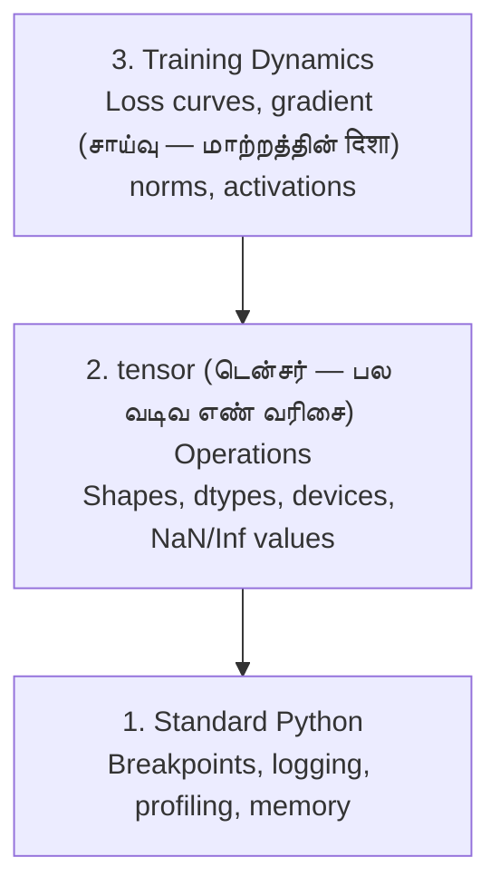

<!-- Tamil-medium simplified version of en.md -->

> **For Tamil-medium students:** This version uses simple English and Tamil hints to explain AI concepts.

# Debugging and Profiling

> The worst AI bugs don't crash. They train silently on garbage and report a beautiful loss curve.

**Type:** Build
**Language:** Python
**Prerequisites:** Lesson 1 (Dev Environment), basic PyTorch familiarity
**Time:** ~60 minutes

## Learning Objectives

- Use conditional `breakpoint()` and `debug_print` to inspect tensor (டென்சர் — பல வடிவ எண் வரிசை) shapes, dtypes, and NaN values mid-training
- Profile training loops with `cProfile`, `line_profiler`, and `tracemalloc` to find bottlenecks
- Detect common AI bugs: shape mismatches, NaN loss, data leakage, and wrong-device tensors
- Set up TensorBoard to visualize loss curves, weight histograms, and gradient (சாய்வு — மாற்றத்தின் दिशा) distributions

## The Problem

AI code fails differently than regular code. A web app crashes with a stack trace. A misconfigured training loop runs for 8 hours, burns $200 in GPU time, and produces a model that predicts the mean of every input. The code never errored. The bug was a tensor (டென்சர் — பல வடிவ எண் வரிசை) on the wrong device, a forgotten `.detach()`, or labels leaking into feature (பண்பு — தகவல் நெடுவரிசை)s.

You need debugging tools that catch these silent failures before they waste your time and compute.

## The Concept

AI debugging operates at three levels:



Most people jump straight to level 3 (staring at tensor (டென்சர் — பல வடிவ எண் வரிசை)Board). But 80% of AI bugs live at levels 1 and 2.

## Build It

### Part 1: Print Debugging (Yes, It Works)

Print debugging gets dismissed. It shouldn't. For tensor (டென்சர் — பல வடிவ எண் வரிசை) code, a targeted print statement beats stepping through a debugger because you need to see shapes, dtypes, and value ranges all at once.

```python
def debug_print(name, tensor (டென்சர் — பல வடிவ எண் வரிசை)):
    print(f"{name}: shape={tensor.shape}, dtype={tensor.dtype}, "
          f"device={tensor.device}, "
          f"min={tensor.min().item():.4f}, max={tensor.max().item():.4f}, "
          f"mean={tensor.mean().item():.4f}, "
          f"has_nan={tensor.isnan().any().item()}")
```

Call this after every suspicious operation. When the bug is found, remove the prints. Simple.

### Part 2: Python Debugger (pdb and breakpoint)

The built-in debugger is underrated for AI work. Drop `breakpoint()` into your training loop and inspect tensor (டென்சர் — பல வடிவ எண் வரிசை)s interactively.

```python
def training_step(model, batch (பத்தி — தொகுப்பு), criterion, optimizer):
    inputs, labels = batch
    outputs = model(inputs)
    loss = criterion(outputs, labels)

    if loss.item() > 100 or torch.isnan(loss):
        breakpoint()

    loss.backward()
    optimizer.step()
```

When the debugger drops you in, useful commands:

- `p outputs.shape` to check shapes
- `p loss.item()` to see the loss value
- `p torch.isnan(outputs).sum()` to count NaNs
- `p model.fc1.weight.grad` to check gradient (சாய்வு — மாற்றத்தின் दिशा)s
- `c` to continue, `q` to quit

This is conditional debugging. You only stop when something looks wrong. For a 10,000-step training run, that matters.

### Part 3: Python Logging

Replace print statements with logging when your debugging goes beyond a quick check.

```python
import logging

logging.basicConfig(
    level=logging.INFO,
    format="%(asctime)s [%(levelname)s] %(message)s",
    handlers=[
        logging.FileHandler("training.log"),
        logging.StreamHandler()
    ]
)
logger = logging.getLogger(__name__)

logger.info("Starting training: lr=%.4f, batch (பத்தி — தொகுப்பு)_size=%d", lr, batch_size)
logger.warning("Loss spike detected: %.4f at step %d", loss.item(), step)
logger.error("NaN loss at step %d, stopping", step)
```

Logging gives you timestamps, severity levels, and file output. When a training run fails at 3 AM, you want a log file, not terminal output that scrolled off screen.

### Part 4: Timing Code Sections

Knowing where time goes is the first step to optimization (உகந்தாக்கம் — சிறந்ததாக்குதல்).

```python
import time

class Timer:
    def __init__(self, name=""):
        self.name = name

    def __enter__(self):
        self.start = time.perf_counter()
        return self

    def __exit__(self, *args):
        elapsed = time.perf_counter() - self.start
        print(f"[{self.name}] {elapsed:.4f}s")

with Timer("data loading"):
    batch (பத்தி — தொகுப்பு) = next(dataloader_iter)

with Timer("forward pass"):
    outputs = model(batch (பத்தி — தொகுப்பு))

with Timer("backward pass"):
    loss.backward()
```

Common finding: data loading takes 60% of training time. The fix is `num_workers > 0` in your DataLoader, not a faster GPU.

### Part 5: cProfile and line_profiler

When you need more than manual timers:

```bash
python -m cProfile -s cumtime train.py
```

This shows every function (சார்பு — உள்ளீட்டுக்கு வெளியீடு) call sorted by cumulative time. For line-by-line profiling:

```bash
pip install line_profiler
```

```python
@profile
def train_step(model, data, target):
    output = model(data)
    loss = F.cross_entropy(output, target)
    loss.backward()
    return loss

# Run with: kernprof -l -v train.py
```

### Part 6: Memory Profiling

#### CPU Memory with tracemalloc

```python
import tracemalloc

tracemalloc.start()

# your code here
model = build_model()
data = load_dataset()

snapshot = tracemalloc.take_snapshot()
top_stats = snapshot.statistics("lineno")
for stat in top_stats[:10]:
    print(stat)
```

#### CPU Memory with memory_profiler

```bash
pip install memory_profiler
```

```python
from memory_profiler import profile

@profile
def load_data():
    raw = read_csv("data.csv")       # watch memory jump here
    processed = preprocess(raw)       # and here
    return processed
```

Run with `python -m memory_profiler your_script.py` to see line-by-line memory usage.

#### GPU Memory with PyTorch

```python
import torch

if torch.cuda.is_available():
    print(torch.cuda.memory_summary())

    print(f"Allocated: {torch.cuda.memory_allocated() / 1e9:.2f} GB")
    print(f"Cached: {torch.cuda.memory_reserved() / 1e9:.2f} GB")
```

When you hit OOM (Out of Memory):

1. Reduce batch (பத்தி — தொகுப்பு) size (first thing to try, always)
2. Use `torch.cuda.empty_cache()` to free cached memory
3. Use `del tensor (டென்சர் — பல வடிவ எண் வரிசை)` followed by `torch.cuda.empty_cache()` for large intermediates
4. Use mixed precision (`torch.cuda.amp`) to halve memory usage
5. Use gradient (சாய்வு — மாற்றத்தின் दिशा) checkpointing for very deep models

### Part 7: Common AI Bugs and How to Catch Them

#### Shape Mismatch

The most frequent bug. A tensor (டென்சர் — பல வடிவ எண் வரிசை) has shape `[batch (பத்தி — தொகுப்பு), feature (பண்பு — தகவல் நெடுவரிசை)s]` when the model expects `[batch, channels, height, width]`.

```python
def check_shapes(model, sample_input):
    print(f"Input: {sample_input.shape}")
    hooks = []

    def make_hook(name):
        def hook(module, inp, out):
            in_shape = inp[0].shape if isinstance(inp, tuple) else inp.shape
            out_shape = out.shape if hasattr(out, "shape") else type(out)
            print(f"  {name}: {in_shape} -> {out_shape}")
        return hook

    for name, module in model.named_modules():
        hooks.append(module.register_forward_hook(make_hook(name)))

    with torch.no_grad():
        model(sample_input)

    for h in hooks:
        h.remove()
```

Run this once with a sample batch (பத்தி — தொகுப்பு). It maps every shape transformation in your model.

#### NaN Loss

NaN loss means something exploded. Common causes:

- Learning rate too high
- Division by zero in custom loss
- Log of zero or negative number
- Exploding gradient (சாய்வு — மாற்றத்தின் दिशा)s in RNNs

```python
def detect_nan(model, loss, step):
    if torch.isnan(loss):
        print(f"NaN loss at step {step}")
        for name, param in model.named_parameter (பாரமீட்டர் — கட்டுப்பாடு)s():
            if param.grad is not None:
                if torch.isnan(param.grad).any():
                    print(f"  NaN gradient (சாய்வு — மாற்றத்தின் दिशा) in {name}")
                if torch.isinf(param.grad).any():
                    print(f"  Inf gradient in {name}")
        return True
    return False
```

#### Data Leakage

Your model gets 99% accuracy on the test set. Sounds great. It's a bug.

```python
def check_data_leakage(train_set, test_set, id_column="id"):
    train_ids = set(train_set[id_column].tolist())
    test_ids = set(test_set[id_column].tolist())
    overlap = train_ids & test_ids
    if overlap:
        print(f"DATA LEAKAGE: {len(overlap)} samples in both train and test")
        return True
    return False
```

Also check for temporal leakage: using future data to predict the past. Sort by timestamp before splitting.

#### Wrong Device

tensor (டென்சர் — பல வடிவ எண் வரிசை)s on different devices (CPU vs GPU) cause runtime errors. But sometimes a tensor silently stays on CPU while everything else is on GPU, and training just runs slowly.

```python
def check_devices(model, *tensor (டென்சர் — பல வடிவ எண் வரிசை)s):
    model_device = next(model.parameter (பாரமீட்டர் — கட்டுப்பாடு)s()).device
    print(f"Model device: {model_device}")
    for i, t in enumerate(tensors):
        if t.device != model_device:
            print(f"  WARNING: tensor {i} on {t.device}, model on {model_device}")
```

### Part 8: tensor (டென்சர் — பல வடிவ எண் வரிசை)Board Basics

tensor (டென்சர் — பல வடிவ எண் வரிசை)Board shows you what's happening inside training over time.

```bash
pip install tensor (டென்சர் — பல வடிவ எண் வரிசை)board
```

```python
from torch.utils.tensor (டென்சர் — பல வடிவ எண் வரிசை)board import SummaryWriter

writer = SummaryWriter("runs/experiment_1")

for step in range(num_steps):
    loss = train_step(model, batch (பத்தி — தொகுப்பு))

    writer.add_scalar (scalar — ஒரு எண்)("loss/train", loss.item(), step)
    writer.add_scalar("lr", optimizer.param_groups[0]["lr"], step)

    if step % 100 == 0:
        for name, param in model.named_parameter (பாரமீட்டர் — கட்டுப்பாடு)s():
            writer.add_histogram(f"weights/{name}", param, step)
            if param.grad is not None:
                writer.add_histogram(f"grads/{name}", param.grad, step)

writer.close()
```

Launch it:

```bash
tensor (டென்சர் — பல வடிவ எண் வரிசை)board --logdir=runs
```

What to look for:

- **Loss not decreasing**: Learning rate too low, or model architecture issue
- **Loss oscillating wildly**: Learning rate too high
- **Loss goes to NaN**: Numerical instability (see NaN section above)
- **Train loss decreasing, val loss increasing**: Overfitting
- **Weight histograms collapsing to zero**: Vanishing gradient (சாய்வு — மாற்றத்தின் दिशा)s
- **Gradient histograms exploding**: Need gradient clipping

### Part 9: VS Code Debugger

For interactive debugging, configure VS Code with a `launch.json`:

```json
{
    "version": "0.2.0",
    "configurations": [
        {
            "name": "Debug Training",
            "type": "debugpy",
            "request": "launch",
            "program": "${file}",
            "console": "integratedTerminal",
            "justMyCode": false
        }
    ]
}
```

Set breakpoints by clicking the gutter. Use the Variables pane to inspect tensor (டென்சர் — பல வடிவ எண் வரிசை) properties. The Debug Console lets you run arbitrary Python expressions mid-execution.

Useful for stepping through data preprocessing pipelines where you want to see each transformation.

## Use It

Here's the debugging workflow that catches most AI bugs:

1. **Before training**: Run `check_shapes` with a sample batch (பத்தி — தொகுப்பு). Verify input and output dimension (பரிமாணம் — கோணம்)s match expectations.
2. **First 10 steps**: Use `debug_print` on loss, outputs, and gradient (சாய்வு — மாற்றத்தின் दिशा)s. Confirm nothing is NaN and values are in reasonable ranges.
3. **During training**: Log loss, learning rate, and gradient norms. Use tensor (டென்சர் — பல வடிவ எண் வரிசை)Board for visualization.
4. **When something breaks**: Drop `breakpoint()` at the failure point. Inspect tensors interactively.
5. **For performance**: Time your data loading vs forward vs backward pass. Profile memory if you're near OOM.

## Ship It

Run the debugging toolkit script:

```bash
python phases/00-setup-and-tooling/12-debugging-and-profiling/code/debug_tools.py
```

See `outputs/prompt-debug-ai-code.md` for a prompt that helps diagnose AI-specific bugs.

## Exercises

1. Run `debug_tools.py` and read through each section's output. Modify the dummy model to introduce a NaN (hint: divide by zero in the forward pass) and watch the detector catch it.
2. Profile a training loop with `cProfile` and identify the slowest function (சார்பு — உள்ளீட்டுக்கு வெளியீடு).
3. Use `tracemalloc` to find which line in your data loading pipeline allocates the most memory.
4. Set up tensor (டென்சர் — பல வடிவ எண் வரிசை)Board for a simple training run and identify whether the model is overfitting.
5. Use `breakpoint()` inside a training loop. Practice inspecting tensor shapes, devices, and gradient (சாய்வு — மாற்றத்தின் दिशा) values from the debugger prompt.

## Key Terms (Tamil-medium)

| English | Tamil | Simple meaning |
|---------|-------|---|
| vector | வெக்டர் | list of numbers = a point |
| matrix | மேட்ரிக்ஸ் | number table that changes things |
| dot product | டாட் புராடக்ட் | measure how similar two lists are |
| algorithm | வழிமுறை | step-by-step way to solve |
| parameter | பாரமீட்டர் | setting that controls output |
| gradient | சாய்வு | direction of biggest change |
| optimization | சிறந்ததாக்குதல் | make it better and better |
| neural network | வலைப்பின்னல் | number machine like a brain |
