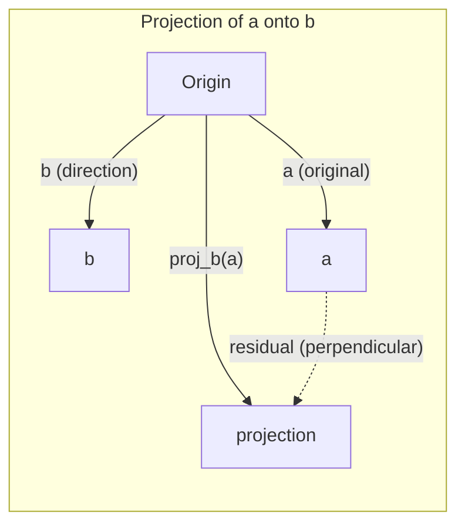

<!-- Tamil-medium simplified version of en.md -->

> **For Tamil-medium students:** This version uses simple English and Tamil hints to explain AI concepts.

# Linear Algebra simple idea

> Every AI model is just matrix (மேட்ரிக்ஸ் — எண் மேஜை) math wearing a fancy hat.

**Type:** Learn
**Languages:** Python, Julia
**Prerequisites:** Phase 0
**Time:** ~60 minutes

## Learning Objectives

- Implement vector (வெக்டர் — எண் பட்டியல்) and matrix (மேட்ரிக்ஸ் — எண் மேஜை) operations (addition, dot product, matrix multiply) from scratch in Python
- Explain geometrically what the dot product, projection, and Gram-Schmidt process do
- Determine linear independence, rank, and basis of a set of vectors using row reduction
- Connect linear algebra concepts to their AI applications: embedding (embedding — பொருளை எண்களாக மாற்றுதல்)s, attention scores, and LoRA

## The Problem

Open any ML paper. Within the first page, you'll see vector (வெக்டர் — எண் பட்டியல்)s, matrices, dot products, and transformations. Without linear algebra simple idea, these are just symbols. With it, you can see what a neural network (வலைப்பின்னல் — மூளை போன்ற எண் அமைப்பு) is actually doing -- moving points around in space.

You don't need to be a mathematician. You need to see what these operations mean geometrically, then code them yourself.

## The Concept

### vector (வெக்டர் — எண் பட்டியல்)s Are Points (and Directions)

A vector (வெக்டர் — எண் பட்டியல்) is just a list of numbers. But those numbers mean something -- they're coordinates in space.

**2D vector (வெக்டர் — எண் பட்டியல்) [3, 2]:**

| x | y | Point |
|---|---|-------|
| 3 | 2 | The vector (வெக்டர் — எண் பட்டியல்) points from origin (0,0) to (3, 2) on the plane |

The vector (வெக்டர் — எண் பட்டியல்) has magnitude sqrt(3^2 + 2^2) = sqrt(13) and points up and to the right.

In AI, vector (வெக்டர் — எண் பட்டியல்)s represent everything:
- A word → a vector of 768 numbers (its "meaning" in embedding (embedding — பொருளை எண்களாக மாற்றுதல்) space)
- An image → a vector of millions of pixel values
- A user → a vector of preferences

### Matrices Are Transformations

A matrix (மேட்ரிக்ஸ் — எண் மேஜை) transforms one vector (வெக்டர் — எண் பட்டியல்) into another. It can rotate, scale, stretch, or project.

```mermaid
graph LR
    subgraph Before
        A["Point A"]
        B["Point B"]
    end
    subgraph matrix (மேட்ரிக்ஸ் — எண் மேஜை)["Matrix Multiplication"]
        M["M (transformation)"]
    end
    subgraph After
        A2["Point A'"]
        B2["Point B'"]
    end
    A --> M
    B --> M
    M --> A2
    M --> B2
```

In AI, matrices ARE the model:
- neural network (வலைப்பின்னல் — மூளை போன்ற எண் அமைப்பு) weights → matrices that transform input into output
- Attention scores → matrices that decide what to focus on
- embedding (embedding — பொருளை எண்களாக மாற்றுதல்)s → matrices that map words to vector (வெக்டர் — எண் பட்டியல்)s

### The Dot Product Measures Similarity

The dot product of two vector (வெக்டர் — எண் பட்டியல்)s tells you how similar they are.

```
a · b = a₁×b₁ + a₂×b₂ + ... + aₙ×bₙ

Same direction:      a · b > 0  (similar)
Perpendicular:       a · b = 0  (unrelated)
Opposite direction:  a · b < 0  (dissimilar)
```

This is literally how search engines, recommendation systems, and RAG work -- find vector (வெக்டர் — எண் பட்டியல்)s with high dot products.

### Linear Independence

vector (வெக்டர் — எண் பட்டியல்)s are linearly independent if no vector in the set is written as a combination of the others. If v1, v2, v3 are independent, they span a 3D space. If one is a combination of the others, they only span a plane.

Why it matters for AI: your feature (பண்பு — தகவல் நெடுவரிசை) matrix (மேட்ரிக்ஸ் — எண் மேஜை) should have linearly independent columns. If two features are perfectly correlated (linearly dependent), the model cannot distinguish their effects. This causes multicollinearity in regression (பின்னடைவு — எண் தொடர்பு கண்டுபிடித்தல்) -- the weight matrix becomes unstable, and small input changes produce wild output swings.

**Concrete example:**

```
v1 = [1, 0, 0]
v2 = [0, 1, 0]
v3 = [2, 1, 0]   # v3 = 2*v1 + v2
```

v1 and v2 are independent -- neither is a scalar (scalar — ஒரு எண்) multiple or combination of the other. But v3 = 2*v1 + v2, so {v1, v2, v3} is a dependent set. These three vector (வெக்டர் — எண் பட்டியல்)s all lie in the xy-plane. No matter how you combine them, you cannot reach [0, 0, 1]. You have three vectors but only two dimension (பரிமாணம் — கோணம்)s of freedom.

In a dataset: if feature (பண்பு — தகவல் நெடுவரிசை)_3 = 2*feature_1 + feature_2, adding feature_3 gives the model zero new information. Worse, it makes the normal equations singular -- there is no unique solution for the weights.

### Basis and Rank

A basis is a minimal set of linearly independent vector (வெக்டர் — எண் பட்டியல்)s that span the entire space. The number of basis vectors is the dimension (பரிமாணம் — கோணம்) of the space.

The standard basis for 3D space is {[1,0,0], [0,1,0], [0,0,1]}. But any three independent vector (வெக்டர் — எண் பட்டியல்)s in 3D form a valid basis. The choice of basis is a choice of coordinate system.

Rank of a matrix (மேட்ரிக்ஸ் — எண் மேஜை) = number of linearly independent columns = number of linearly independent rows. If rank < min(rows, cols), the matrix is rank-deficient. This means:
- The system has infinitely many solutions (or none)
- Information is lost in the transformation
- The matrix cannot be inverted

| Situation | Rank | What it means for ML |
|-----------|------|---------------------|
| Full rank (rank = min(m, n)) | Maximum possible | Unique least-squares solution exists. Model is well-conditioned. |
| Rank deficient (rank < min(m, n)) | Below maximum | feature (பண்பு — தகவல் நெடுவரிசை)s are redundant. Infinitely many weight solutions. Regularization needed. |
| Rank 1 | 1 | Every column is a scaled copy of one vector (வெக்டர் — எண் பட்டியல்). All data lies on a line. |
| Near rank-deficient (small singular values) | Numerically low | matrix (மேட்ரிக்ஸ் — எண் மேஜை) is ill-conditioned. Tiny input noise causes large output changes. Use SVD truncation or ridge regression (பின்னடைவு — எண் தொடர்பு கண்டுபிடித்தல்). |

### Projection

Projecting vector (வெக்டர் — எண் பட்டியல்) **a** onto vector **b** gives the component of **a** in the direction of **b**:

```
proj_b(a) = (a dot b / b dot b) * b
```

The residual (a - proj_b(a)) is perpendicular to b. This orthogonal decomposition is the foundation of least-squares fitting.

Projection is everywhere in ML:
- Linear regression (பின்னடைவு — எண் தொடர்பு கண்டுபிடித்தல்) minimizes the distance from observations to the column space -- the solution IS a projection
- PCA projects data onto the directions of maximum variance
- Attention in transformers computes projections of queries onto keys



**Example:** a = [3, 4], b = [1, 0]

proj_b(a) = (3*1 + 4*0) / (1*1 + 0*0) * [1, 0] = 3 * [1, 0] = [3, 0]

The projection drops the y-component. This is dimension (பரிமாணம் — கோணம்)ality reduction in its simplest form -- throw away the directions you don't care about.

### Gram-Schmidt Process

Converting any set of independent vector (வெக்டர் — எண் பட்டியல்)s into an orthonormal basis. Orthonormal means every vector has length 1 and every pair is perpendicular.

The algorithm (அல்கோரிதம் — வழிமுறை):
1. Take the first vector (வெக்டர் — எண் பட்டியல்), normalize it
2. Take the second vector, subtract its projection onto the first, normalize
3. Take the third vector, subtract its projections onto all previous vectors, normalize
4. Repeat for remaining vectors

```
Input:  v1, v2, v3, ... (linearly independent)

u1 = v1 / |v1|

w2 = v2 - (v2 dot u1) * u1
u2 = w2 / |w2|

w3 = v3 - (v3 dot u1) * u1 - (v3 dot u2) * u2
u3 = w3 / |w3|

Output: u1, u2, u3, ... (orthonormal basis)
```

This is how QR decomposition works internally. Q is the orthonormal basis, R captures the projection coefficients. QR decomposition helps in:
- Solving linear systems (more stable than Gaussian elimination)
- Computing eigenvalues (QR algorithm (அல்கோரிதம் — வழிமுறை))
- Least-squares regression (பின்னடைவு — எண் தொடர்பு கண்டுபிடித்தல்) (the standard numerical method)

```figure
eigen-directions
```

## Build It

### Step 1: vector (வெக்டர் — எண் பட்டியல்)s from scratch (Python)

```python
class vector (வெக்டர் — எண் பட்டியல்):
    def __init__(self, components):
        self.components = list(components)
        self.dim = len(self.components)

    def __add__(self, other):
        return vector (வெக்டர் — எண் பட்டியல்)([a + b for a, b in zip(self.components, other.components)])

    def __sub__(self, other):
        return vector (வெக்டர் — எண் பட்டியல்)([a - b for a, b in zip(self.components, other.components)])

    def dot(self, other):
        return sum(a * b for a, b in zip(self.components, other.components))

    def magnitude(self):
        return sum(x**2 for x in self.components) ** 0.5

    def normalize(self):
        mag = self.magnitude()
        return vector (வெக்டர் — எண் பட்டியல்)([x / mag for x in self.components])

    def cosine_similarity(self, other):
        return self.dot(other) / (self.magnitude() * other.magnitude())

    def __repr__(self):
        return f"vector (வெக்டர் — எண் பட்டியல்)({self.components})"


a = vector (வெக்டர் — எண் பட்டியல்)([1, 2, 3])
b = Vector([4, 5, 6])

print(f"a + b = {a + b}")
print(f"a · b = {a.dot(b)}")
print(f"|a| = {a.magnitude():.4f}")
print(f"cosine similarity = {a.cosine_similarity(b):.4f}")
```

### Step 2: Matrices from scratch (Python)

```python
class matrix (மேட்ரிக்ஸ் — எண் மேஜை):
    def __init__(self, rows):
        self.rows = [list(row) for row in rows]
        self.shape = (len(self.rows), len(self.rows[0]))

    def __matmul__(self, other):
        if isinstance(other, vector (வெக்டர் — எண் பட்டியல்)):
            return Vector([
                sum(self.rows[i][j] * other.components[j] for j in range(self.shape[1]))
                for i in range(self.shape[0])
            ])
        rows = []
        for i in range(self.shape[0]):
            row = []
            for j in range(other.shape[1]):
                row.append(sum(
                    self.rows[i][k] * other.rows[k][j]
                    for k in range(self.shape[1])
                ))
            rows.append(row)
        return matrix (மேட்ரிக்ஸ் — எண் மேஜை)(rows)

    def transpose(self):
        return matrix (மேட்ரிக்ஸ் — எண் மேஜை)([
            [self.rows[j][i] for j in range(self.shape[0])]
            for i in range(self.shape[1])
        ])

    def __repr__(self):
        return f"matrix (மேட்ரிக்ஸ் — எண் மேஜை)({self.rows})"


rotation_90 = matrix (மேட்ரிக்ஸ் — எண் மேஜை)([[0, -1], [1, 0]])
point = vector (வெக்டர் — எண் பட்டியல்)([3, 1])

rotated = rotation_90 @ point
print(f"Original: {point}")
print(f"Rotated 90°: {rotated}")
```

### Step 3: Why this matters for AI

```python
import random

random.seed(42)
weights = matrix (மேட்ரிக்ஸ் — எண் மேஜை)([[random.gauss(0, 0.1) for _ in range(3)] for _ in range(2)])
input_vector (வெக்டர் — எண் பட்டியல்) = Vector([1.0, 0.5, -0.3])

output = weights @ input_vector (வெக்டர் — எண் பட்டியல்)
print(f"Input (3D): {input_vector}")
print(f"Output (2D): {output}")
print("This is what a neural network (வலைப்பின்னல் — மூளை போன்ற எண் அமைப்பு) layer does -- matrix (மேட்ரிக்ஸ் — எண் மேஜை) multiplication.")
```

### Step 4: Julia version

```julia
a = [1.0, 2.0, 3.0]
b = [4.0, 5.0, 6.0]

println("a + b = ", a + b)
println("a · b = ", a ⋅ b)       # Julia supports unicode operators
println("|a| = ", √(a ⋅ a))
println("cosine = ", (a ⋅ b) / (√(a ⋅ a) * √(b ⋅ b)))

# matrix (மேட்ரிக்ஸ் — எண் மேஜை)-vector (வெக்டர் — எண் பட்டியல்) multiplication
W = [0.1 -0.2 0.3. 0.4 0.5 -0.1]
x = [1.0, 0.5, -0.3]
println("Wx = ", W * x)
println("This is a neural network (வலைப்பின்னல் — மூளை போன்ற எண் அமைப்பு) layer.")
```

### Step 5: Linear independence and projection from scratch (Python)

```python
def is_linearly_independent(vector (வெக்டர் — எண் பட்டியல்)s):
    n = len(vectors)
    dim = len(vectors[0].components)
    mat = matrix (மேட்ரிக்ஸ் — எண் மேஜை)([v.components[:] for v in vectors])
    rows = [row[:] for row in mat.rows]
    rank = 0
    for col in range(dim):
        pivot = None
        for row in range(rank, len(rows)):
            if abs(rows[row][col]) > 1e-10:
                pivot = row
                break
        if pivot is None:
            continue
        rows[rank], rows[pivot] = rows[pivot], rows[rank]
        scale = rows[rank][col]
        rows[rank] = [x / scale for x in rows[rank]]
        for row in range(len(rows)):
            if row != rank and abs(rows[row][col]) > 1e-10:
                factor = rows[row][col]
                rows[row] = [rows[row][j] - factor * rows[rank][j] for j in range(dim)]
        rank += 1
    return rank == n


def project(a, b):
    scalar (scalar — ஒரு எண்) = a.dot(b) / b.dot(b)
    return vector (வெக்டர் — எண் பட்டியல்)([scalar * x for x in b.components])


def gram_schmidt(vector (வெக்டர் — எண் பட்டியல்)s):
    orthonormal = []
    for v in vectors:
        w = v
        for u in orthonormal:
            proj = project(w, u)
            w = w - proj
        if w.magnitude() < 1e-10:
            continue
        orthonormal.append(w.normalize())
    return orthonormal


v1 = vector (வெக்டர் — எண் பட்டியல்)([1, 0, 0])
v2 = Vector([1, 1, 0])
v3 = Vector([1, 1, 1])
basis = gram_schmidt([v1, v2, v3])
for i, u in enumerate(basis):
    print(f"u{i+1} = {u}")
    print(f"  |u{i+1}| = {u.magnitude():.6f}")

print(f"u1 · u2 = {basis[0].dot(basis[1]):.6f}")
print(f"u1 · u3 = {basis[0].dot(basis[2]):.6f}")
print(f"u2 · u3 = {basis[1].dot(basis[2]):.6f}")
```

## Use It

Now the same thing with NumPy -- what you'll actually use in practice:

```python
import numpy as np

a = np.array([1, 2, 3], dtype=float)
b = np.array([4, 5, 6], dtype=float)

print(f"a + b = {a + b}")
print(f"a · b = {np.dot(a, b)}")
print(f"|a| = {np.linalg.norm(a):.4f}")
print(f"cosine = {np.dot(a, b) / (np.linalg.norm(a) * np.linalg.norm(b)):.4f}")

W = np.random.randn(2, 3) * 0.1
x = np.array([1.0, 0.5, -0.3])
print(f"Wx = {W @ x}")
```

### Rank, Projection, and QR with NumPy

```python
import numpy as np

A = np.array([[1, 2], [2, 4]])
print(f"Rank: {np.linalg.matrix (மேட்ரிக்ஸ் — எண் மேஜை)_rank(A)}")

a = np.array([3, 4])
b = np.array([1, 0])
proj = (np.dot(a, b) / np.dot(b, b)) * b
print(f"Projection of {a} onto {b}: {proj}")

Q, R = np.linalg.qr(np.random.randn(3, 3))
print(f"Q is orthogonal: {np.allclose(Q @ Q.T, np.eye(3))}")
print(f"R is upper triangular: {np.allclose(R, np.triu(R))}")
```

### PyTorch -- tensor (டென்சர் — பல வடிவ எண் வரிசை)s Are vector (வெக்டர் — எண் பட்டியல்)s with Autodiff

```python
import torch

x = torch.randn(3, requires_grad=True)
y = torch.tensor (டென்சர் — பல வடிவ எண் வரிசை)([1.0, 0.0, 0.0])

similarity = torch.dot(x, y)
similarity.backward()

print(f"x = {x.data}")
print(f"y = {y.data}")
print(f"dot product = {similarity.item():.4f}")
print(f"d(dot)/dx = {x.grad}")
```

The gradient (சாய்வு — மாற்றத்தின் दिशा) of the dot product with respect to x is just y. PyTorch computed this automatically. Every operation in a neural network (வலைப்பின்னல் — மூளை போன்ற எண் அமைப்பு) is built from operations like this -- matrix (மேட்ரிக்ஸ் — எண் மேஜை) multiplies, dot products, projections -- and autodiff tracks gradients through all of them.

You just built from scratch what NumPy does in one line. Now you know what's happening under the hood.

## Ship It

This lesson produces:
- `outputs/prompt-linear-algebra-tutor.md` -- a prompt for AI assistants to teach linear algebra through geometric simple idea

## Connections

Everything in this lesson connects to specific parts of modern AI:

| Concept | Where it shows up |
|---------|------------------|
| Dot product | Attention scores in transformers, cosine similarity in RAG |
| matrix (மேட்ரிக்ஸ் — எண் மேஜை) multiply | Every neural network (வலைப்பின்னல் — மூளை போன்ற எண் அமைப்பு) layer, every linear transformation |
| Linear independence | feature (பண்பு — தகவல் நெடுவரிசை) selection, avoiding multicollinearity |
| Rank | Determining if a system is solvable, LoRA (low-rank adaptation) |
| Projection | Linear regression (பின்னடைவு — எண் தொடர்பு கண்டுபிடித்தல்) (projecting onto column space), PCA |
| Gram-Schmidt / QR | Numerical solvers, eigenvalue calculation |
| Orthonormal basis | Stable numerical calculation, whitening transforms |

LoRA deserves special mention. It fine-tunes large language models by decomposing weight updates into low-rank matrices. Instead of updating a 4096x4096 weight matrix (மேட்ரிக்ஸ் — எண் மேஜை) (16M parameter (பாரமீட்டர் — கட்டுப்பாடு)s), LoRA updates two matrices of size 4096x16 and 16x4096 (131K parameters). The rank-16 constraint means LoRA assumes the weight update lives in a 16-dimension (பரிமாணம் — கோணம்)al subspace of the full 4096-dimensional space. That is linear algebra doing real work.

## Exercises

1. Implement `vector (வெக்டர் — எண் பட்டியல்).angle_between(other)` that returns the angle in degrees between two vectors
2. Create a 2D scaling matrix (மேட்ரிக்ஸ் — எண் மேஜை) that doubles the x-coordinate and triples the y-coordinate, then apply it to the vector [1, 1]
3. Given 5 random word-like vectors (dimension (பரிமாணம் — கோணம்) 50), find the two most similar using cosine similarity
4. Verify that the Gram-Schmidt output is truly orthonormal: check that every pair has dot product 0 and every vector has magnitude 1
5. Create a 3x3 matrix with rank 2. Verify using the `rank()` method. Then explain what geometric object the columns span.
6. Project the vector [1, 2, 3] onto [1, 1, 1]. What does the result represent geometrically?

## Key Terms

| Term | What people say | What it actually means |
|------|----------------|----------------------|
| vector (வெக்டர் — எண் பட்டியல்) | "An arrow" | A list of numbers representing a point or direction in n-dimension (பரிமாணம் — கோணம்)al space |
| matrix (மேட்ரிக்ஸ் — எண் மேஜை) | "A table of numbers" | A transformation that maps vectors from one space to another |
| Dot product | "Multiply and sum" | A measure of how aligned two vectors are -- the core of similarity search |
| embedding (embedding — பொருளை எண்களாக மாற்றுதல்) | "Some AI magic" | A vector that represents the meaning of something (word, image, user) |
| Linear independence | "They don't overlap" | No vector in the set is written as a combination of the others |
| Rank | "How many dimensions" | The number of linearly independent columns (or rows) in a matrix |
| Projection | "The shadow" | The component of one vector in the direction of another |
| Basis | "The coordinate axes" | A minimal set of independent vectors that span the space |
| Orthonormal | "Perpendicular unit vectors" | Vectors that are mutually perpendicular and each have length 1 |
