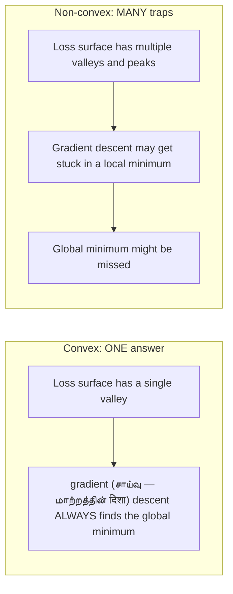
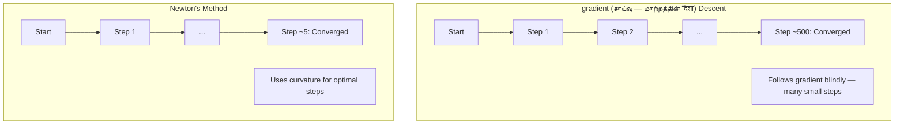
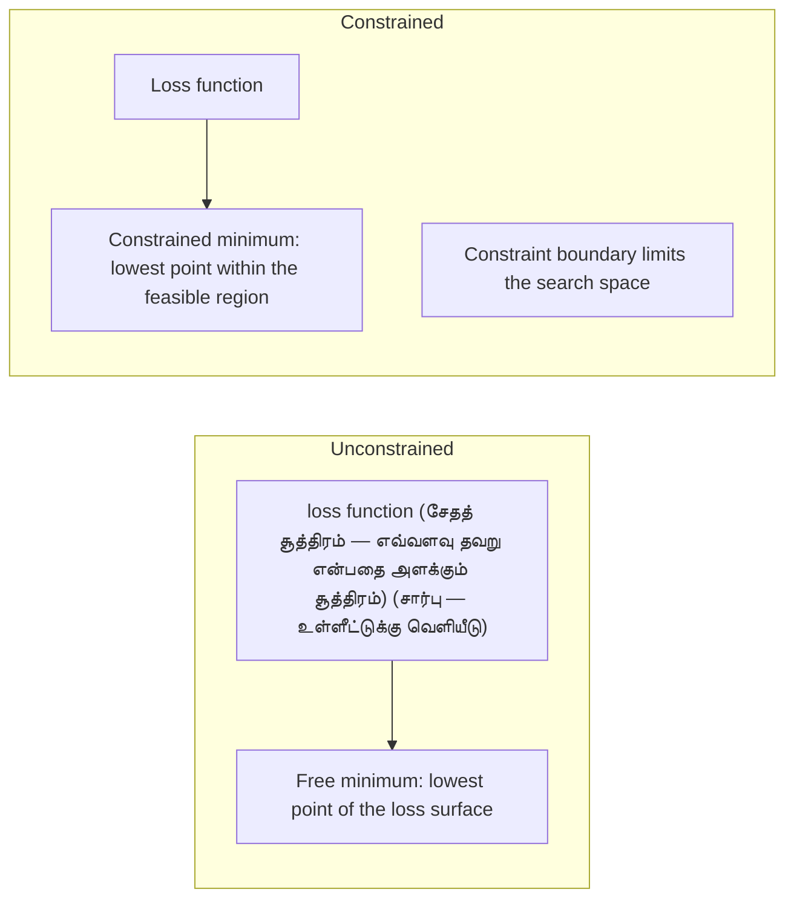
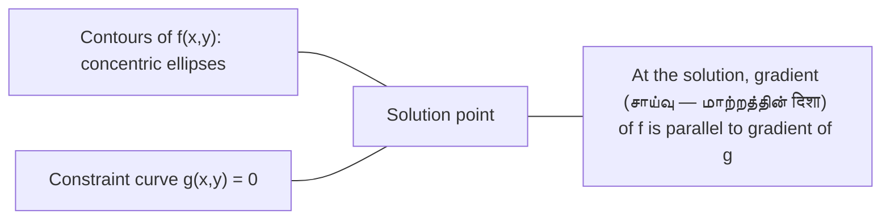

<!-- Tamil-medium simplified version of en.md -->

> **For Tamil-medium students:** This version uses simple English and Tamil hints to explain AI concepts.

# Convex optimization (உகந்தாக்கம் — சிறந்ததாக்குதல்)

> Convex problems have one valley. neural network (வலைப்பின்னல் — மூளை போன்ற எண் அமைப்பு)s have millions. Knowing the difference matters.

**Type:** Build
**Language:** Python
**Prerequisites:** Phase 1, Lessons 04 (Calculus for ML), 08 (optimization (உகந்தாக்கம் — சிறந்ததாக்குதல்))
**Time:** ~90 minutes

## Learning Objectives

- Test whether a function (சார்பு — உள்ளீட்டுக்கு வெளியீடு) is convex using the definition, second derivative, and Hessian criteria
- Implement Newton's method and compare its quadratic convergence (ஒருங்கிணைப்பு — ஒரு பதிலில் சேர்ந்துவருதல்) against gradient (சாய்வு — மாற்றத்தின் दिशा) descent
- Solve constrained optimization (உகந்தாக்கம் — சிறந்ததாக்குதல்) problems using Lagrange multipliers and interpret KKT conditions
- Explain why neural network (வலைப்பின்னல் — மூளை போன்ற எண் அமைப்பு) loss landscapes are non-convex yet SGD still finds good solutions

## The Problem

Lesson 08 taught you gradient (சாய்வு — மாற்றத்தின் दिशा) descent, momentum, and Adam. Those optimizers walk downhill on any surface. But they come with no guarantees. Gradient descent on a non-convex landscape might land in a bad local minimum, get stuck on a saddle point, or oscillate forever. You used it anyway because neural network (வலைப்பின்னல் — மூளை போன்ற எண் அமைப்பு)s are non-convex and there is no alternative.

But many problems in machine learning are convex. Linear regression (பின்னடைவு — எண் தொடர்பு கண்டுபிடித்தல்), logistic regression, SVMs, LASSO, ridge regression. For these, something stronger exists: optimization (உகந்தாக்கம் — சிறந்ததாக்குதல்) with mathematical guarantees. A convex problem has exactly one valley. Any algorithm (அல்கோரிதம் — வழிமுறை) that walks downhill will reach the global minimum. No restarts needed. No learning rate schedules. No prayer.

Understanding convexity does three things. First, it tells you when your problem is easy (convex) versus hard (non-convex). Second, it gives you faster tools like Newton's method for convex problems. Third, it explains concepts that appear throughout ML: regularization as a constraint, duality in SVMs, and why deep learning (ஆழ் கற்றல் — பல்லாய கொட்ட பயிற்சி) works despite violating every nice property convexity gives you.

## The Concept

### Convex sets

A set S is convex if for any two points in S, the line segment between them also lies entirely in S.

| Convex sets | Not convex |
|---|---|
| **Rectangle**: any two points inside is connected by a line segment that stays inside | **Star/crescent shape**: a line between two interior points can pass outside the set |
| **Triangle**: same property holds for all interior points | **Donut/annulus**: the hole means some line segments leave the set |
| The line segment between any two points stays within the set | The line segment between some pairs of points exits the set |

Formal test: for any points x, y in S and any t in [0, 1], the point tx + (1-t)y is also in S.

Examples of convex sets:
- A line, a plane, all of R^n
- A ball (circle, sphere, hypersphere)
- A halfspace: {x : a^T x <= b}
- The intersection of any number of convex sets

Examples of non-convex sets:
- A donut (annulus)
- The union of two disjoint circles
- Any set with a "dent" or "hole"

### Convex function (சார்பு — உள்ளீட்டுக்கு வெளியீடு)s

A function (சார்பு — உள்ளீட்டுக்கு வெளியீடு) f is convex if its domain is a convex set and for any two points x, y in its domain and any t in [0, 1]:

```
f(tx + (1-t)y) <= t*f(x) + (1-t)*f(y)
```

Geometrically: the line segment between any two points on the graph lies above or on the graph.

| Property | Convex function (சார்பு — உள்ளீட்டுக்கு வெளியீடு) | Non-convex function |
|---|---|---|
| **Line segment test** | The line between any two points on the graph lies **above or on** the curve | The line between some points on the graph dips **below** the curve |
| **Shape** | Single bowl/valley curving upward | Multiple peaks and valleys with mixed curvature |
| **Local minima** | Every local minimum is the global minimum | Multiple local minima may exist at different heights |

Common convex function (சார்பு — உள்ளீட்டுக்கு வெளியீடு)s:
- f(x) = x^2 (parabola)
- f(x) = |x| (absolute value)
- f(x) = e^x (exponential)
- f(x) = max(0, x) (ReLU, though piecewise linear)
- f(x) = -log(x) for x > 0 (negative log)
- Any linear function f(x) = a^T x + b (both convex and concave)

### Testing for convexity

Three practical tests, from easiest to most rigorous.

**Test 1: Second derivative test (1D).** If f''(x) >= 0 for all x, then f is convex.

- f(x) = x^2: f''(x) = 2 >= 0. Convex.
- f(x) = x^3: f''(x) = 6x. Negative for x < 0. Not convex.
- f(x) = e^x: f''(x) = e^x > 0. Convex.

**Test 2: Hessian test (multivariate).** If the Hessian matrix (மேட்ரிக்ஸ் — எண் மேஜை) H(x) is positive semidefinite for all x, then f is convex. The Hessian is the matrix of second partial derivatives.

**Test 3: Definition test.** Check the inequality f(tx + (1-t)y) <= t*f(x) + (1-t)*f(y) directly. Useful for function (சார்பு — உள்ளீட்டுக்கு வெளியீடு)s where derivatives are hard to compute.

### Why convexity matters

The central theorem of convex optimization (உகந்தாக்கம் — சிறந்ததாக்குதல்):

**For a convex function (சார்பு — உள்ளீட்டுக்கு வெளியீடு), every local minimum is a global minimum.**

This means gradient (சாய்வு — மாற்றத்தின் दिशा) descent cannot get trapped. Any downhill path leads to the same answer. The algorithm (அல்கோரிதம் — வழிமுறை) is guaranteed to converge to the optimal solution.



Consequences:
- No need for random restarts
- No need for sophisticated learning rate schedules
- convergence (ஒருங்கிணைப்பு — ஒரு பதிலில் சேர்ந்துவருதல்) proofs are possible (rate depends on function (சார்பு — உள்ளீட்டுக்கு வெளியீடு) properties)
- The solution is unique (up to flat regions)

### Convex vs non-convex in ML

| Problem | Convex? | Why |
|---------|---------|-----|
| Linear regression (பின்னடைவு — எண் தொடர்பு கண்டுபிடித்தல்) (MSE) | Yes | Loss is quadratic in weights |
| Logistic regression | Yes | Log-loss is convex in weights |
| SVM (hinge loss) | Yes | Maximum of linear function (சார்பு — உள்ளீட்டுக்கு வெளியீடு)s |
| LASSO (L1 regression) | Yes | Sum of convex functions is convex |
| Ridge regression (L2) | Yes | Quadratic + quadratic = convex |
| neural network (வலைப்பின்னல் — மூளை போன்ற எண் அமைப்பு) (any loss) | No | Nonlinear activations create non-convex landscape |
| k-means clustering | No | Discrete assignment step |
| matrix (மேட்ரிக்ஸ் — எண் மேஜை) factorization | No | Product of unknowns |

Linear models with convex losses are convex. The moment you add hidden layers with nonlinear activations, convexity breaks.

### The Hessian matrix (மேட்ரிக்ஸ் — எண் மேஜை)

The Hessian H of a function (சார்பு — உள்ளீட்டுக்கு வெளியீடு) f: R^n -> R is the n x n matrix (மேட்ரிக்ஸ் — எண் மேஜை) of second partial derivatives.

```
H[i][j] = d^2 f / (dx_i dx_j)
```

For f(x, y) = x^2 + 3xy + y^2:

```
df/dx = 2x + 3y       d^2f/dx^2 = 2      d^2f/dxdy = 3
df/dy = 3x + 2y       d^2f/dydx = 3      d^2f/dy^2 = 2

H = [ 2  3 ]
    [ 3  2 ]
```

The Hessian tells you about curvature:
- Eigenvalues all positive: the function (சார்பு — உள்ளீட்டுக்கு வெளியீடு) curves upward in every direction (convex at that point)
- Eigenvalues all negative: curves downward in every direction (concave, a local max)
- Mixed signs: saddle point (curves up in some directions, down in others)
- Zero eigenvalue: flat in that direction (degenerate)

For convexity, the Hessian must be positive semidefinite (all eigenvalues >= 0) everywhere, not just at one point.

### Newton's method

gradient (சாய்வு — மாற்றத்தின் दिशा) descent uses first-order information (the gradient). Newton's method uses second-order information (the Hessian). It fits a quadratic approximation at the current point and jumps directly to the minimum of that quadratic.

```
Update rule:
  x_new = x - H^(-1) * gradient (சாய்வு — மாற்றத்தின் दिशा)

Compare to gradient (சாய்வு — மாற்றத்தின் दिशा) descent:
  x_new = x - lr * gradient
```

Newton's method replaces the scalar (scalar — ஒரு எண்) learning rate with the inverse Hessian. This automatically adjusts the step size and direction based on local curvature.



Advantages:
- Quadratic convergence (ஒருங்கிணைப்பு — ஒரு பதிலில் சேர்ந்துவருதல்) near the minimum (error squares each step)
- No learning rate to tune
- Scale-invariant (works regardless of how you control with settings the problem)

Disadvantages:
- Computing the Hessian costs O(n^2) memory and O(n^3) to invert
- For a neural network (வலைப்பின்னல் — மூளை போன்ற எண் அமைப்பு) with 1 million weights, that is 10^12 entries and 10^18 operations
- Not practical for deep learning (ஆழ் கற்றல் — பல்லாய கொட்ட பயிற்சி)

### Constrained optimization (உகந்தாக்கம் — சிறந்ததாக்குதல்)

Unconstrained optimization (உகந்தாக்கம் — சிறந்ததாக்குதல்): minimize f(x) over all x.
Constrained optimization: minimize f(x) subject to constraints.

Real problems have constraints. You want to minimize cost but your budget is limited. You want to minimize error but your model complexity is bounded.



### Lagrange multipliers

The method of Lagrange multipliers converts a constrained problem into an unconstrained one.

Problem: minimize f(x) subject to g(x) = 0.

Solution: introduce a new variable (the Lagrange multiplier lambda) and solve the unconstrained problem:

```
L(x, lambda) = f(x) + lambda * g(x)
```

At the solution, the gradient (சாய்வு — மாற்றத்தின் दिशा) of L is zero:

```
dL/dx = df/dx + lambda * dg/dx = 0
dL/dlambda = g(x) = 0
```

Geometric simple idea: at the constrained minimum, the gradient (சாய்வு — மாற்றத்தின் दिशा) of f must be parallel to the gradient of the constraint g. If they were not parallel, you could move along the constraint surface and reduce f further.



Example: minimize f(x,y) = x^2 + y^2 subject to x + y = 1.

```
L = x^2 + y^2 + lambda(x + y - 1)

dL/dx = 2x + lambda = 0  =>  x = -lambda/2
dL/dy = 2y + lambda = 0  =>  y = -lambda/2
dL/dlambda = x + y - 1 = 0

From first two: x = y
Substituting: 2x = 1, so x = y = 0.5, lambda = -1
```

The closest point on the line x + y = 1 to the origin is (0.5, 0.5).

### KKT conditions

The Karush-Kuhn-Tucker conditions extend Lagrange multipliers to inequality constraints.

Problem: minimize f(x) subject to g_i(x) <= 0 for i = 1, ..., m.

The KKT conditions (necessary for optimality):

```
1. Stationarity:    df/dx + sum(lambda_i * dg_i/dx) = 0
2. Primal feasibility:  g_i(x) <= 0  for all i
3. Dual feasibility:    lambda_i >= 0  for all i
4. Complementary slackness:  lambda_i * g_i(x) = 0  for all i
```

Complementary slackness is the key insight: either the constraint is active (g_i = 0, the solution sits on the boundary) or the multiplier is zero (the constraint does not matter). A constraint that does not affect the solution has lambda = 0.

KKT conditions are central to SVMs. The support vector (வெக்டர் — எண் பட்டியல்)s are the data points where the constraint is active (lambda > 0). All other data points have lambda = 0 and do not affect the decision boundary.

### Regularization as constrained optimization (உகந்தாக்கம் — சிறந்ததாக்குதல்)

L1 and L2 regularization are not arbitrary tricks. They are constrained optimization (உகந்தாக்கம் — சிறந்ததாக்குதல்) problems in disguise.

**L2 regularization (Ridge):**

```
minimize  Loss(w)  subject to  ||w||^2 <= t

Equivalent unconstrained form:
minimize  Loss(w) + lambda * ||w||^2
```

The constraint ||w||^2 <= t defines a ball (circle in 2D, sphere in 3D). The solution is where the loss contours first touch this ball.

**L1 regularization (LASSO):**

```
minimize  Loss(w)  subject to  ||w||_1 <= t

Equivalent unconstrained form:
minimize  Loss(w) + lambda * ||w||_1
```

The constraint ||w||_1 <= t defines a diamond (rotated square in 2D).

| Property | L2 constraint (circle) | L1 constraint (diamond) |
|---|---|---|
| **Constraint shape** | Circle (sphere in higher dims) | Diamond (rotated square in 2D) |
| **Where loss contour touches** | Smooth boundary — any point on the circle | Corner — aligned with an axis |
| **Solution behavior** | Weights are small but nonzero | Some weights are exactly zero (sparse) |
| **Result** | Weight shrinkage | feature (பண்பு — தகவல் நெடுவரிசை) selection |

This explains why L1 produces sparse models (feature (பண்பு — தகவல் நெடுவரிசை) selection) while L2 only shrinks weights. The diamond has corners aligned with axes. Loss contours are more likely to touch a corner, setting one or more weights exactly to zero.

### Duality

Every constrained optimization (உகந்தாக்கம் — சிறந்ததாக்குதல்) problem (the primal) has a companion problem (the dual). For convex problems, the primal and dual have the same optimal value. This is strong duality.

The Lagrangian dual function (சார்பு — உள்ளீட்டுக்கு வெளியீடு):

```
Primal: minimize f(x) subject to g(x) <= 0
Lagrangian: L(x, lambda) = f(x) + lambda * g(x)
Dual function (சார்பு — உள்ளீட்டுக்கு வெளியீடு): d(lambda) = min_x L(x, lambda)
Dual problem: maximize d(lambda) subject to lambda >= 0
```

Why duality matters:
- The dual problem is sometimes easier to solve than the primal
- SVMs are solved in their dual form, where the problem depends on dot products between data points (enabling the kernel trick)
- The dual provides a lower bound on the primal optimum, useful for checking solution quality

For SVMs specifically:

```
Primal: find w, b that maximize the margin 2/||w|| subject to
        y_i(w^T x_i + b) >= 1 for all i

Dual:   maximize sum(alpha_i) - 0.5 * sum_ij(alpha_i * alpha_j * y_i * y_j * x_i^T x_j)
        subject to alpha_i >= 0 and sum(alpha_i * y_i) = 0

The dual only involves dot products x_i^T x_j.
Replace x_i^T x_j with K(x_i, x_j) to get the kernel trick.
```

### Why deep learning (ஆழ் கற்றல் — பல்லாய கொட்ட பயிற்சி) works despite non-convexity

neural network (வலைப்பின்னல் — மூளை போன்ற எண் அமைப்பு) loss function (சேதத் சூத்திரம் — எவ்வளவு தவறு என்பதை அளக்கும் சூத்திரம்) (சார்பு — உள்ளீட்டுக்கு வெளியீடு)s are wildly non-convex. By every classical measure, optimizing them should fail. Yet stochastic gradient (சாய்வு — மாற்றத்தின் दिशा) descent finds good solutions reliably. Several factors explain this.

**Most local minima are good enough.** In high-dimension (பரிமாணம் — கோணம்)al spaces, random critical points (where the gradient (சாய்வு — மாற்றத்தின் दिशा) is zero) are overwhelmingly saddle points, not local minima. The few local minima that exist tend to have loss values close to the global minimum. Getting trapped in a terrible local minimum is extremely unlikely when the parameter (பாரமீட்டர் — கட்டுப்பாடு) space has millions of dimensions.

**Saddle points, not local minima, are the real obstacle.** In a function (சார்பு — உள்ளீட்டுக்கு வெளியீடு) with n parameter (பாரமீட்டர் — கட்டுப்பாடு)s, a saddle point has a mix of positive and negative curvature directions. For a random critical point in high dimension (பரிமாணம் — கோணம்)s, the probability of all n eigenvalues being positive (local minimum) is roughly 2^(-n). Almost all critical points are saddle points. SGD's noise helps escape them.

**Overparameter (பாரமீட்டர் — கட்டுப்பாடு)ization smooths the landscape.** Networks with more parameters than training examples have smoother, more connected loss surfaces. Wider networks have fewer bad local minima. This is counterintuitive but empirically consistent.

**Loss landscape structure:**

| Property | Low-dimension (பரிமாணம் — கோணம்)al space | High-dimensional space |
|---|---|---|
| **Landscape** | Many isolated peaks and valleys | Smoothly connected valleys |
| **Minima** | Many isolated local minima | Few bad local minima. most are near-optimal |
| **Navigation** | Hard to find global minimum | Many paths lead to good solutions |
| **Critical points** | Mix of local minima and saddle points | Overwhelmingly saddle points, not local minima |

**Stochastic noise acts as implicit regularization.** Mini-batch (பத்தி — தொகுப்பு) SGD adds noise that prevents settling into sharp minima. Sharp minima overfit. flat minima generalize. The noise biases optimization (உகந்தாக்கம் — சிறந்ததாக்குதல்) toward flat regions of the loss landscape.

### Second-order methods in practice

Pure Newton's method is impractical for large models. Several approximations make second-order information usable.

**L-BFGS (Limited-memory BFGS):** Approximates the inverse Hessian using the last m gradient (சாய்வு — மாற்றத்தின் दिशा) differences. Requires O(mn) memory instead of O(n^2). Works well for problems with up to ~10,000 parameter (பாரமீட்டர் — கட்டுப்பாடு)s. Used in classical ML (logistic regression (பின்னடைவு — எண் தொடர்பு கண்டுபிடித்தல்), CRFs) but not deep learning (ஆழ் கற்றல் — பல்லாய கொட்ட பயிற்சி).

**Natural gradient (சாய்வு — மாற்றத்தின் दिशा):** Uses the Fisher information matrix (மேட்ரிக்ஸ் — எண் மேஜை) (expected Hessian of the log-likelihood) instead of the standard Hessian. This accounts for the geometry of probability distributions. K-FAC (Kronecker-Factored Approximate Curvature) approximates the Fisher matrix as a Kronecker product, making it practical for neural network (வலைப்பின்னல் — மூளை போன்ற எண் அமைப்பு)s.

**Hessian-free optimization (உகந்தாக்கம் — சிறந்ததாக்குதல்):** Uses conjugate gradient (சாய்வு — மாற்றத்தின் दिशा) to solve Hx = g without ever forming H. Only requires Hessian-vector (வெக்டர் — எண் பட்டியல்) products, which is computed in O(n) time via automatic differentiation.

**Diagonal approximations:** Adam's second moment is a diagonal approximation of the Hessian's diagonal. AdaHessian extends this by using actual Hessian diagonal elements via Hutchinson's estimator.

| Method | Memory | Per-step cost | When to use |
|--------|--------|--------------|-------------|
| gradient (சாய்வு — மாற்றத்தின் दिशा) descent | O(n) | O(n) | Baseline, large models |
| Newton's method | O(n^2) | O(n^3) | Small convex problems |
| L-BFGS | O(mn) | O(mn) | Medium convex problems |
| Adam | O(n) | O(n) | deep learning (ஆழ் கற்றல் — பல்லாய கொட்ட பயிற்சி) default |
| K-FAC | O(n) | O(n) per layer | Research, large-batch (பத்தி — தொகுப்பு) training |

```figure
convex-vs-nonconvex
```

## Build It

### Step 1: Convexity checker

Build a function (சார்பு — உள்ளீட்டுக்கு வெளியீடு) that tests convexity empirically by sampling points and checking the definition.

```python
import random
import math

def check_convexity(f, dim, bounds=(-5, 5), samples=1000):
    violations = 0
    for _ in range(samples):
        x = [random.uniform(*bounds) for _ in range(dim)]
        y = [random.uniform(*bounds) for _ in range(dim)]
        t = random.uniform(0, 1)
        mid = [t * xi + (1 - t) * yi for xi, yi in zip(x, y)]
        lhs = f(mid)
        rhs = t * f(x) + (1 - t) * f(y)
        if lhs > rhs + 1e-10:
            violations += 1
    return violations == 0, violations
```

### Step 2: Newton's method for 2D

Implement Newton's method using an explicit Hessian. Compare convergence (ஒருங்கிணைப்பு — ஒரு பதிலில் சேர்ந்துவருதல்) speed against gradient (சாய்வு — மாற்றத்தின் दिशा) descent.

```python
def newtons_method(f, grad_f, hessian_f, x0, steps=50, tol=1e-12):
    x = list(x0)
    history = [x[:]]
    for _ in range(steps):
        g = grad_f(x)
        H = hessian_f(x)
        det = H[0][0] * H[1][1] - H[0][1] * H[1][0]
        if abs(det) < 1e-15:
            break
        H_inv = [
            [H[1][1] / det, -H[0][1] / det],
            [-H[1][0] / det, H[0][0] / det],
        ]
        dx = [
            H_inv[0][0] * g[0] + H_inv[0][1] * g[1],
            H_inv[1][0] * g[0] + H_inv[1][1] * g[1],
        ]
        x = [x[0] - dx[0], x[1] - dx[1]]
        history.append(x[:])
        if sum(gi ** 2 for gi in g) < tol:
            break
    return history
```

### Step 3: Lagrange multiplier solver

Solve constrained optimization (உகந்தாக்கம் — சிறந்ததாக்குதல்) using gradient (சாய்வு — மாற்றத்தின் दिशा) descent on the Lagrangian.

```python
def lagrange_solve(f_grad, g_val, g_grad, x0, lr=0.01,
                   lr_lambda=0.01, steps=5000):
    x = list(x0)
    lam = 0.0
    history = []
    for _ in range(steps):
        fg = f_grad(x)
        gv = g_val(x)
        gg = g_grad(x)
        x = [
            xi - lr * (fgi + lam * ggi)
            for xi, fgi, ggi in zip(x, fg, gg)
        ]
        lam = lam + lr_lambda * gv
        history.append((x[:], lam, gv))
    return history
```

### Step 4: Compare first-order vs second-order

Run gradient (சாய்வு — மாற்றத்தின் दिशा) descent and Newton's method on the same quadratic function (சார்பு — உள்ளீட்டுக்கு வெளியீடு). Count the steps to convergence (ஒருங்கிணைப்பு — ஒரு பதிலில் சேர்ந்துவருதல்).

```python
def quadratic(x):
    return 5 * x[0] ** 2 + x[1] ** 2

def quadratic_grad(x):
    return [10 * x[0], 2 * x[1]]

def quadratic_hessian(x):
    return [[10, 0], [0, 2]]
```

Newton's method will converge in 1 step (it is exact for quadratics). gradient (சாய்வு — மாற்றத்தின் दिशा) descent will take hundreds of steps because the eigenvalues of the Hessian differ by a factor of 5, creating an elongated valley.

## Use It

Convexity analysis applies directly when choosing ML models and solvers.

For convex problems (logistic regression (பின்னடைவு — எண் தொடர்பு கண்டுபிடித்தல்), SVMs, LASSO):
- Use dedicated solvers (liblinear, CVXPY, scipy.optimize.minimize with method='L-BFGS-B')
- Expect a unique global solution
- Second-order methods are practical and fast

For non-convex problems (neural network (வலைப்பின்னல் — மூளை போன்ற எண் அமைப்பு)s):
- Use first-order methods (SGD, Adam)
- Accept that the solution depends on initialization and randomness
- Use overparameter (பாரமீட்டர் — கட்டுப்பாடு)ization, noise, and learning rate schedules as implicit regularization
- Do not waste time searching for the global minimum. A good local minimum is sufficient.

```python
from scipy.optimize import minimize

result = minimize(
    fun=lambda w: sum((y - X @ w) ** 2) + 0.1 * sum(w ** 2),
    x0=np.zeros(d),
    method='L-BFGS-B',
    jac=lambda w: -2 * X.T @ (y - X @ w) + 0.2 * w,
)
```

For SVMs, the dual formulation lets you use the kernel trick:

```python
from sklearn.svm import SVC

svm = SVC(kernel='rbf', C=1.0)
svm.fit(X_train, y_train)
print(f"Support vector (வெக்டர் — எண் பட்டியல்)s: {svm.n_support_}")
```

## Exercises

1. **Convexity gallery.** Test these function (சார்பு — உள்ளீட்டுக்கு வெளியீடு)s for convexity using the checker: f(x) = x^4, f(x) = sin(x), f(x,y) = x^2 + y^2, f(x,y) = x*y, f(x) = max(x, 0). Explain why each result makes sense.

2. **Newton vs gradient (சாய்வு — மாற்றத்தின் दिशा) descent race.** Run both methods on f(x,y) = 50*x^2 + y^2 from the starting point (10, 10). How many steps does each need to reach loss < 1e-10? What happens to gradient descent when the condition number (ratio of largest to smallest Hessian eigenvalue) increases?

3. **Lagrange multiplier geometry.** Minimize f(x,y) = (x-3)^2 + (y-3)^2 subject to x + 2y = 4. Verify the solution by checking that the gradient (சாய்வு — மாற்றத்தின் दिशा) of f is parallel to the gradient of g at the solution.

4. **Regularization constraint.** Implement L1-constrained optimization (உகந்தாக்கம் — சிறந்ததாக்குதல்): minimize (x-3)^2 + (y-2)^2 subject to |x| + |y| <= 1. Show that the solution has one coordinate equal to zero (sparsity from the diamond constraint).

5. **Hessian eigenvalue analysis.** Compute the Hessian of the Rosenbrock function (சார்பு — உள்ளீட்டுக்கு வெளியீடு) at (1,1) and at (-1,1). Compute eigenvalues at both points. What do the eigenvalues tell you about the curvature at the minimum versus far from it?

## Key Terms

| Term | What it means |
|------|---------------|
| Convex set | A set where the line segment between any two points in the set stays inside the set |
| Convex function (சார்பு — உள்ளீட்டுக்கு வெளியீடு) | A function where the line between any two points on its graph lies above or on the graph. Equivalently, Hessian is positive semidefinite everywhere |
| Local minimum | A point lower than all nearby points. For convex functions, every local minimum is the global minimum |
| Global minimum | The lowest point of a function over its entire domain |
| Hessian matrix (மேட்ரிக்ஸ் — எண் மேஜை) | The matrix of all second partial derivatives. Encodes curvature information |
| Positive semidefinite | A matrix whose eigenvalues are all non-negative. The multidimension (பரிமாணம் — கோணம்)al analogue of "second derivative >= 0" |
| Condition number | Ratio of largest to smallest eigenvalue of the Hessian. High condition number means elongated valleys and slow gradient (சாய்வு — மாற்றத்தின் दिशा) descent |
| Newton's method | Second-order optimizer that uses the inverse Hessian to determine step direction and size. Quadratic convergence (ஒருங்கிணைப்பு — ஒரு பதிலில் சேர்ந்துவருதல்) near the minimum |
| Lagrange multiplier | A variable introduced to convert a constrained optimization (உகந்தாக்கம் — சிறந்ததாக்குதல்) problem into an unconstrained one |
| KKT conditions | Necessary conditions for optimality with inequality constraints. Generalize Lagrange multipliers |
| Complementary slackness | At the solution, either a constraint is active or its multiplier is zero. Never both nonzero |
| Duality | Every constrained problem has a companion dual problem. For convex problems, both have the same optimal value |
| Strong duality | Primal and dual optimal values are equal. Holds for convex problems satisfying Slater's condition |
| L-BFGS | Approximate second-order method that stores the last m gradient differences instead of the full Hessian |
| Saddle point | A point where the gradient is zero but it is a minimum in some directions and a maximum in others |
| Overparameter (பாரமீட்டர் — கட்டுப்பாடு)ization | Using more parameters than training examples. Smooths the loss landscape and reduces bad local minima |

## Further Reading

- [Boyd & Vandenberghe: Convex optimization (உகந்தாக்கம் — சிறந்ததாக்குதல்)](https://web.stanford.edu/~boyd/cvxbook/) - the standard textbook, freely available online
- [Bottou, Curtis, Nocedal: Optimization Methods for Large-Scale Machine Learning (2018)](https://arxiv.org/abs/1606.04838) - bridges convex optimization theory and deep learning (ஆழ் கற்றல் — பல்லாய கொட்ட பயிற்சி) practice
- [Choromanska et al.: The Loss Surfaces of Multilayer Networks (2015)](https://arxiv.org/abs/1412.0233) - why non-convex neural network (வலைப்பின்னல் — மூளை போன்ற எண் அமைப்பு) landscapes are not as bad as they seem
- [Nocedal & Wright: Numerical Optimization](https://link.springer.com/book/10.1007/978-0-387-40065-5) - comprehensive reference for Newton's method, L-BFGS, and constrained optimization
