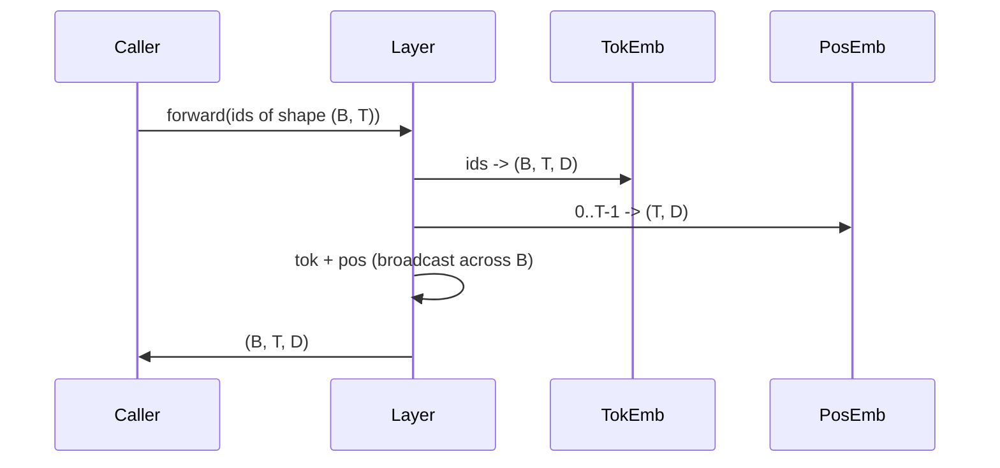

<!-- Tamil-medium simplified version of en.md -->

> **For Tamil-medium students:** This version uses simple English and Tamil hints to explain AI concepts.

# Token and Positional embedding (embedding — பொருளை எண்களாக மாற்றுதல்)s

> Ids are integers. The model wants vector (வெக்டர் — எண் பட்டியல்)s. Two lookup tables sit between them, and the choice of the positional one shapes what the model can learn.

**Type:** Build
**Languages:** Python
**Prerequisites:** Phase 04 lessons, Phase 07 transformer lessons, Lessons 30 and 31 of this phase
**Time:** ~90 minutes

## Learning Objectives
- Build a token-embedding (embedding — பொருளை எண்களாக மாற்றுதல்) lookup table that maps vocabulary ids to dense vector (வெக்டர் — எண் பட்டியல்)s.
- Build a learned positional-embedding lookup table indexed by position.
- Build a fixed sinusoidal positional embedding indexed by position with no parameter (பாரமீட்டர் — கட்டுப்பாடு)s.
- Compose token and positional embeddings into a single input for a transformer block.
- Contrast learned and sinusoidal embeddings on length generalization and parameter count.

## The frame

The model's first contact with a token id is a row lookup in the token-embedding (embedding — பொருளை எண்களாக மாற்றுதல்) matrix (மேட்ரிக்ஸ் — எண் மேஜை). The matrix has one row per vocabulary id and one column per model dimension (பரிமாணம் — கோணம்). The lookup returns a vector (வெக்டர் — எண் பட்டியல்) that the rest of the model treats as the meaning of the id. Backprop updates the rows that were used in the forward pass. Over training the geometry of those rows learns to encode similarity in directions.

Token ids alone have no order. The model needs a second signal that tells it position one is different from position seventeen. The two dominant choices for that signal are a learned positional embedding (embedding — பொருளை எண்களாக மாற்றுதல்) (a second lookup table, one row per position) and a fixed sinusoidal positional embedding (a math formula with no parameter (பாரமீட்டர் — கட்டுப்பாடு)s). The choice has consequences. A learned table is a parameter and is bounded by the maximum context length the model was trained on. A sinusoidal table is parameter-free in theory and the formula extends to any position, but this lesson's `SinusoidalPositionalEmbedding` precomputes a fixed table at `max_context_length` and its `forward` raises past that bound. both modules therefore enforce a maximum context length here. The model may still struggle past its training length even when the table is large enough to index.

This lesson builds both and composes them with the token embedding (embedding — பொருளை எண்களாக மாற்றுதல்) into a single input for the next lesson's attention block.

## The shape contract

The input to the embedding (embedding — பொருளை எண்களாக மாற்றுதல்) stage is a batch (பத்தி — தொகுப்பு) of token ids of shape `(B, T)`. The output is a tensor (டென்சர் — பல வடிவ எண் வரிசை) of shape `(B, T, D)` where `D` is the model dimension (பரிமாணம் — கோணம்). Every batch element has the same context length `T`. Every position has the same vector (வெக்டர் — எண் பட்டியல்) dimension `D`.

```mermaid
flowchart LR
    A["(B, T) token ids"] --> B[token embedding (embedding — பொருளை எண்களாக மாற்றுதல்) lookup]
    B --> C["(B, T, D) token vector (வெக்டர் — எண் பட்டியல்)s"]
    A --> D[position broadcast 0..T-1]
    D --> E[positional embedding lookup]
    E --> F["(B, T, D) position vectors"]
    C --> G[elementwise sum]
    F --> G
    G --> H["(B, T, D) input to attention"]
```

The composition is a sum, not a concatenation. Summing keeps `D` constant through the network and lets the model decide on a per-feature (பண்பு — தகவல் நெடுவரிசை) basis whether the token meaning or the position dominates at each layer.

## The token embedding (embedding — பொருளை எண்களாக மாற்றுதல்) matrix (மேட்ரிக்ஸ் — எண் மேஜை)

The token embedding (embedding — பொருளை எண்களாக மாற்றுதல்) is a parameter (பாரமீட்டர் — கட்டுப்பாடு) tensor (டென்சர் — பல வடிவ எண் வரிசை) of shape `(V, D)` where `V` is the vocabulary size. PyTorch exposes it as `nn.Embedding(V, D)`. At init the entries are drawn from a small Gaussian, traditionally with mean zero and standard deviation around `0.02` for transformer-scale models. The exact init matters less than that it stays consistent across runs.

The forward pass is a single indexing operation. PyTorch maps `(B, T)` int64 ids to `(B, T, D)` floats by gathering rows. The backward pass accumulates gradient (சாய்வு — மாற்றத்தின் दिशा)s only into the rows that were touched in the forward pass. Two rows that never appeared in the batch (பத்தி — தொகுப்பு) receive zero gradient on that step.

A subtle detail. The token embedding (embedding — பொருளை எண்களாக மாற்றுதல்) and the output projection at the end of the model often share weights (weight tying). When that happens, every backward pass touches every row of the embedding through the output side. The lesson here exposes both as separate modules but the same matrix (மேட்ரிக்ஸ் — எண் மேஜை) could play both roles in a full model.

## The learned positional embedding (embedding — பொருளை எண்களாக மாற்றுதல்)

The learned positional embedding (embedding — பொருளை எண்களாக மாற்றுதல்) is a second `nn.Embedding` of shape `(max_context_length, D)`. The lookup is keyed by position id `0, 1, 2, ..., T-1`. The forward pass broadcasts that position vector (வெக்டர் — எண் பட்டியல்) across the batch (பத்தி — தொகுப்பு) dimension (பரிமாணம் — கோணம்).

The downside of the learned table is that it cannot be queried at position `T` if the model was only trained up to position `T-1`. The row does not exist. Production decoder-only models that use this scheme bake the maximum context length into the architecture and refuse to process longer inputs.

## The sinusoidal positional embedding (embedding — பொருளை எண்களாக மாற்றுதல்)

The sinusoidal positional embedding (embedding — பொருளை எண்களாக மாற்றுதல்) is a function (சார்பு — உள்ளீட்டுக்கு வெளியீடு) from position to vector (வெக்டர் — எண் பட்டியல்). Position `p` and feature (பண்பு — தகவல் நெடுவரிசை) `i` produce

```python
angle = p / (10000 ** (2 * (i // 2) / D))
emb[p, 2k]     = sin(angle)
emb[p, 2k + 1] = cos(angle)
```

The function (சார்பு — உள்ளீட்டுக்கு வெளியீடு) has no parameter (பாரமீட்டர் — கட்டுப்பாடு)s. Every position has a unique vector (வெக்டர் — எண் பட்டியல்). The wavelength varies geometrically across feature (பண்பு — தகவல் நெடுவரிசை) dimension (பரிமாணம் — கோணம்)s, so the lower dimensions encode coarse position and the higher dimensions encode fine position.

The property that follows from the choice of `sin` and `cos` together is that the vector (வெக்டர் — எண் பட்டியல்) at position `p + k` is a linear function (சார்பு — உள்ளீட்டுக்கு வெளியீடு) of the vector at position `p`. That gives the attention layer an easy path to learning relative-position offsets. The model does not need a separate parameter (பாரமீட்டர் — கட்டுப்பாடு) to express "look five tokens back."

The lesson computes the full sinusoidal table once at construction and indexes into it at forward time.

## The composition

The input pipeline does three things in order. Read the token ids. Look up the token vector (வெக்டர் — எண் பட்டியல்)s. Add the positional vectors. Return the sum.



The broadcasting in the sum step replicates the `(T, D)` positional tensor (டென்சர் — பல வடிவ எண் வரிசை) along the batch (பத்தி — தொகுப்பு) dimension (பரிமாணம் — கோணம்). PyTorch handles that automatically because the positional tensor has shape `(1, T, D)` after unsqueeze.

## Contrastive analysis

The lesson runs both variants on the same inputs and prints two diagnostics.

The first is parameter (பாரமீட்டர் — கட்டுப்பாடு) count. The learned variant adds `max_context_length * D` parameters on top of the token embedding (embedding — பொருளை எண்களாக மாற்றுதல்). The sinusoidal variant adds zero.

The second is the cosine similarity between embedding (embedding — பொருளை எண்களாக மாற்றுதல்)s at neighbouring positions. The sinusoidal variant has a smooth and predictable decay because the function (சார்பு — உள்ளீட்டுக்கு வெளியீடு) is continuous. The learned variant at initialization has near-random similarity because the rows are drawn independently. After training, the learned variant usually develops a similar smooth structure, but it has to discover that structure from data.

## What this lesson does not do

It does not build rotary positional encoding (RoPE) or AliBi. Those are the modern choices in production transformers. They both follow the same shape contract as the embedding (embedding — பொருளை எண்களாக மாற்றுதல்)s here (apply a position-dependent transformation to vector (வெக்டர் — எண் பட்டியல்)s of shape `(B, T, D)`) but they apply at the attention-projection step quite than at the input. The next lesson builds the attention block, and one of the optional extensions is to fold rotary into the query-key projections there.

It does not train the embedding (embedding — பொருளை எண்களாக மாற்றுதல்). Training requires a loss, which requires a model output, which requires attention and an LM head. That is the next lesson and the one after.

## How to read the code

`main.py` defines three modules. `Tokenembedding (embedding — பொருளை எண்களாக மாற்றுதல்)` wraps `nn.Embedding(V, D)`. `LearnedPositionalEmbedding` wraps `nn.Embedding(L, D)`. `SinusoidalPositionalEmbedding` precomputes the table and exposes it as a buffer. `EmbeddingComposer` ties a token embedding and a positional embedding together. The demo at the bottom prints the shapes, the parameter (பாரமீட்டர் — கட்டுப்பாடு) counts, and the neighbour-position similarity diagnostic. The tests in `code/tests/test_embeddings.py` pin shape, broadcast behaviour, parameter count, and the sinusoidal formula.

Run the demo. Then change the model dimension (பரிமாணம் — கோணம்) `D` from 64 to 32 and watch how the sinusoidal wavelength bands change.

## Key Terms (Tamil-medium)

| English | Tamil | Simple meaning |
|---------|-------|---|
| vector | வெக்டர் | list of numbers = a point |
| matrix | மேட்ரிக்ஸ் | number table that changes things |
| dot product | டாட் புராடக்ட் | measure how similar two lists are |
| algorithm | வழிமுறை | step-by-step way to solve |
| parameter | பாரமீட்டர் | setting that controls output |
| gradient | சாய்வு | direction of biggest change |
| optimization | சிறந்ததாக்குதல் | make it better and better |
| neural network | வலைப்பின்னல் | number machine like a brain |
