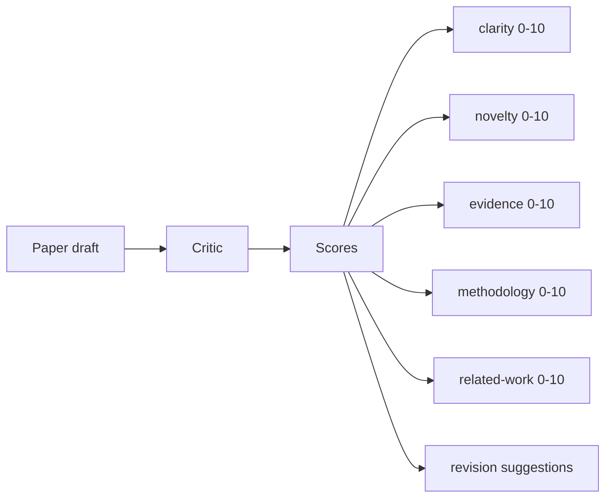
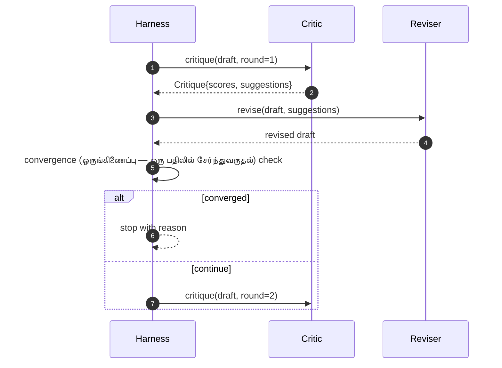

<!-- Tamil-medium simplified version of en.md -->

> **For Tamil-medium students:** This version uses simple English and Tamil hints to explain AI concepts.

# Critic Loop

> A critic that returns "looks good" the first time is broken. A critic that always returns "needs work" is broken. The interesting critic is the one that converges, and you have to engineer convergence (ஒருங்கிணைப்பு — ஒரு பதிலில் சேர்ந்துவருதல்).

**Type:** Build
**Languages:** Python
**Prerequisites:** Phase 19 lessons 50-53
**Time:** ~90 minutes

## Learning Objectives

- Score a paper draft across five fixed dimension (பரிமாணம் — கோணம்)s: clarity, novelty, evidence, methodology, related-work.
- Apply each round's critique as a structured revision diff quite than a freeform rewrite.
- Detect convergence (ஒருங்கிணைப்பு — ஒரு பதிலில் சேர்ந்துவருதல்) by comparing scores across rounds. stop on plateau, target met, or budget exhausted.
- Cap rounds with a max-iteration (மறுயுதல் — மீண்டும் செய்தல்) budget so a non-converging critic does not run forever.
- Emit a per-round trace so the dashboard or the next stage can render the score trajectory.

## Why five fixed dimension (பரிமாணம் — கோணம்)s

A freeform critic is a model that returns a paragraph of suggestions. The next round's revision treats the paragraph as ambient context. Whether the rewrite addresses the criticism is unverifiable because the criticism never had structure.

Five dimension (பரிமாணம் — கோணம்)s give the harness a contract.



The score is a vector (வெக்டர் — எண் பட்டியல்). The harness watches each dimension (பரிமாணம் — கோணம்) across rounds. A revision that raises clarity but tanks evidence is a regression (பின்னடைவு — எண் தொடர்பு கண்டுபிடித்தல்) on evidence, and the convergence (ஒருங்கிணைப்பு — ஒரு பதிலில் சேர்ந்துவருதல்) check sees it. A model-only critic cannot offer that guarantee.

## The Critique shape

```mermaid
flowchart TB
    Critique[Critique] --> Scores[scores dict]
    Critique --> Sugg[suggestions list]
    Sugg --> S1[Suggestion: dimension (பரிமாணம் — கோணம்), target, edit]
    Critique --> Round[round int]
    Critique --> Reason[overall reason str]
```

Every suggestion carries the dimension (பரிமாணம் — கோணம்) it improves, the section it targets, and an `edit` instruction the reviser can apply. The reviser is also a callable. The lesson ships a deterministic reviser that interprets the edit instruction as an append-to-section operation. A model-driven reviser would interpret the same field as a prompt. The contract does not change.

## convergence (ஒருங்கிணைப்பு — ஒரு பதிலில் சேர்ந்துவருதல்) rules, in order

The critic loop terminates when any one of three conditions fires.

```mermaid
flowchart TB
    Start[Round n complete] --> A{All five dimension (பரிமாணம் — கோணம்)s ge target?}
    A -- yes --> Stop1[converged: target]
    A -- no --> B{Plateau detected?}
    B -- yes --> Stop2[converged: plateau]
    B -- no --> C{Round ge max?}
    C -- yes --> Stop3[stopped: budget]
    C -- no --> Next[Run round n plus 1]
```

The target is the strictest case: every one of the five dimension (பரிமாணம் — கோணம்)s (clarity, novelty, evidence, methodology, related_work) must hit `>= target_score` (default `8.0`) before the loop returns success. A high mean with one weak dimension is not enough. Plateau detection compares the current round's mean to the previous round's mean. If the improvement is below `plateau_epsilon` (default `0.1`) for two consecutive rounds, the loop exits with `plateau`. The budget is a hard cap on rounds (default `5`) and exits with `budget`.

The order matters. Target wins over plateau wins over budget. If round three hits the target on the same iteration (மறுயுதல் — மீண்டும் செய்தல்) that would also trigger a plateau, the result is `target`, not `plateau`.

## Why plateau detection runs over two rounds

A one-round plateau is noise. A real critic returns a slightly different score each iteration (மறுயுதல் — மீண்டும் செய்தல்) even on a fixed draft, because deterministic scoring still depends on which suggestions were applied and in what order. Requiring two consecutive plateau rounds filters that noise out. If the harness reports a plateau, the draft has genuinely stopped improving.

## The deterministic critic in this lesson

The lesson does not call a model. The shipped critic is a callable that scores a draft based on three signals: average section body length (clarity), figure count and citation count (evidence), and an `originality_tag` field on the paper metadata (novelty). The reviser knows how to push each score upward.

```text
clarity      grows when the average section body length increases
novelty      grows when originality_tag is set to "high"
evidence     grows when a section's figure_refs is non-empty
methodology  grows when a section titled "Method" exists with body
related-work grows when a section titled "Related Work" exists with body
```

The reviser interprets each suggestion as a targeted append. After round one, the harness can observe the score going up. The tests use this property to assert the loop reduces the gap.

## The full loop contract



The harness owns the round counter, the trace, and the convergence (ஒருங்கிணைப்பு — ஒரு பதிலில் சேர்ந்துவருதல்) check. The critic owns the score. The reviser owns the diff. None of the three touches the others' state.

## The Trace output

Every round emits one trace event with the round number, the score vector (வெக்டர் — எண் பட்டியல்), the suggestion count, and the convergence (ஒருங்கிணைப்பு — ஒரு பதிலில் சேர்ந்துவருதல்) verdict. The full trace is returned alongside the final draft. A downstream dashboard can render the score-per-round chart. The next lesson, the iteration (மறுயுதல் — மீண்டும் செய்தல்) scheduler, reads the trace to decide whether the branch is worth keeping.

## Budgets that protect against bad critics

A critic that produces suggestions that never improve the score will lock the loop into the max-iteration (மறுயுதல் — மீண்டும் செய்தல்) ceiling. The trace makes that visible: five rounds, scores flat, verdict `budget`. The user reads that as a critic bug, not a draft bug. The alternative, surfacing only the final draft, hides the diagnosis. Trace-first design surfaces it.

## How to read the code

`code/main.py` defines `Critique`, `Suggestion`, `Critic` protocol, `Reviser` protocol, `CriticLoop`, and a `make_deterministic_critic_pair` factory that returns the deterministic critic and a matching reviser. A minimal `Paper` shape is included so the lesson stands alone.

`code/tests/test_critic_loop.py` covers: monotone improvement after round one, target convergence (ஒருங்கிணைப்பு — ஒரு பதிலில் சேர்ந்துவருதல்) on a tuned draft, plateau detection after two flat rounds, budget exhaustion when no suggestion improves, suggestion application by the reviser, and trace shape.

## Going further

Two extensions a real how to build will want. First, dimension (பரிமாணம் — கோணம்) weights: a paper for a workshop weights novelty higher than methodology. a journal weights the inverse. The convergence (ஒருங்கிணைப்பு — ஒரு பதிலில் சேர்ந்துவருதல்) check becomes a weighted mean. Second, paired critics: one critic scores, a second critic adjudicates the suggestions before the reviser sees them. Both add value, both compose on the same `Critique` shape.

The bet is the score vector (வெக்டர் — எண் பட்டியல்). Once the critique is structured, every other improvement, convergence (ஒருங்கிணைப்பு — ஒரு பதிலில் சேர்ந்துவருதல்) rule, dashboard, paired critic, drops in without changing the loop.

## Key Terms (Tamil-medium)

| English | Tamil | Simple meaning |
|---------|-------|---|
| vector | வெக்டர் | list of numbers = a point |
| matrix | மேட்ரிக்ஸ் | number table that changes things |
| dot product | டாட் புராடக்ட் | measure how similar two lists are |
| algorithm | வழிமுறை | step-by-step way to solve |
| parameter | பாரமீட்டர் | setting that controls output |
| gradient | சாய்வு | direction of biggest change |
| optimization | சிறந்ததாக்குதல் | make it better and better |
| neural network | வலைப்பின்னல் | number machine like a brain |
